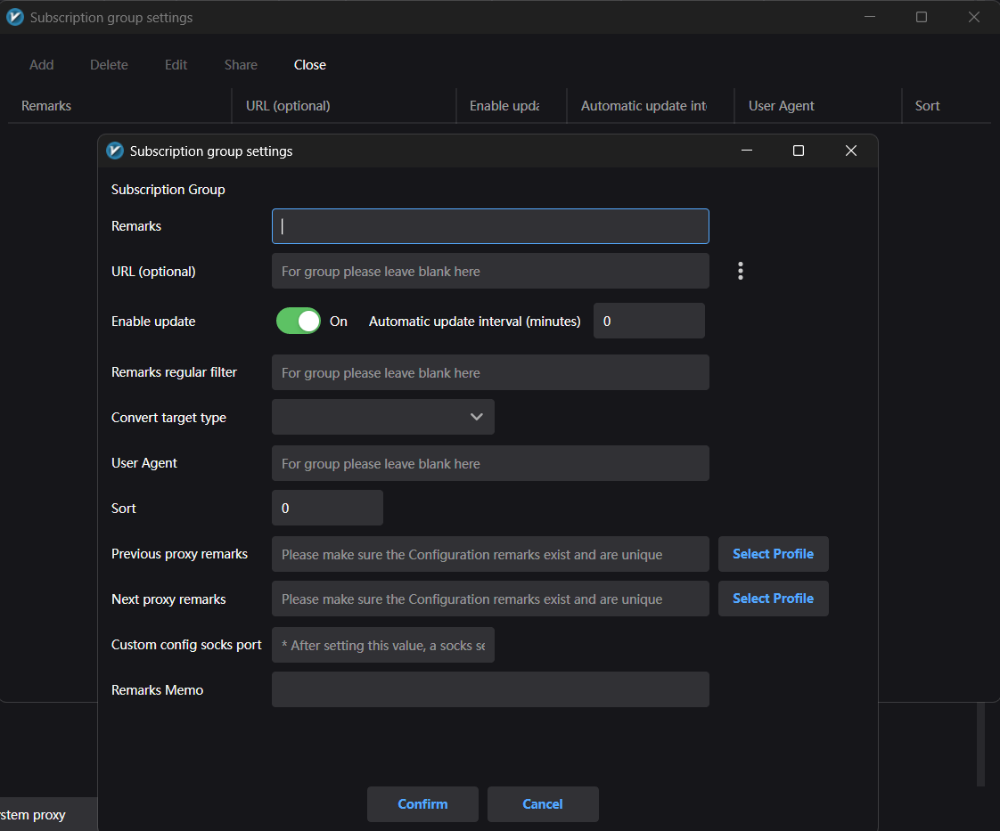

# xray-tutorial
Tutorial for xray desktop (windows 10+) and mobile (android) via V2RayN &amp; V2RayNG

* **Полезные ссылки**: [H89K](https://t.me/h89k_bot), [Xray](https://github.com/XTLS/Xray-core), [V2Ray](https://github.com/v2fly/v2ray-core), [Vless](https://github.com/XTLS/Xray-core/discussions/3518), [V2RayN](https://github.com/2dust/v2rayN), [V2RayNG](https://github.com/2dust/v2rayNG).

* **Навигация**: [Windows 10+](https://github.com/ExTreeMe7/xray-tutorial/blob/main/README.md#v2rayn-windows-10-wiki%E7%AE%80%E4%BD%93%E4%B8%AD%E6%96%87) and [FAQ](https://github.com/ExTreeMe7/xray-tutorial/blob/main/README.md#faq-wiki%E5%B8%B8%E8%A7%81%E9%97%AE%E9%A2%98), [Android](https://github.com/ExTreeMe7/xray-tutorial/blob/main/README.md#v2rayng-android).

## xray-core
[**Xray**](https://github.com/XTLS/Xray-core) — это высокопроизводительный прокси-сервер и платформа для сетевой маршрутизации, форвардинга и обхода блокировок. Xray - форк проекта [V2Ray](https://github.com/v2fly/v2ray-core), с улучшенной архитектурой и новыми функциями для маршрутизации и безопасности.

### Основные характеристики
**Xray** поддерживает протоколы VLESS, VMess, Trojan, Shadowsocks и другие.
Используется для создания VPN/прокси-соединений и обхода сетевых фильтров.
Может работать с TLS/SSL, WebSocket, HTTP/2, QUIC и другими транспортами.
Часто применяется в сочетании с клиентами вроде v2rayNG, для безопасного и приватного интернет-трафика.

### Ссылки доступа
[**Share Link**](github.com/XTLS/Xray-core/discussions/716) - ссылка с конфигурацией подключения, которую можно импортировать в прокси-клиент одним нажатием.

> **Пример**: *`vless://8484dff8-9625-413e-a69c-8c28bbab5754@65.188.99.72:18888?security=reality&sni=yahoo.com&fp=chrome&pbk=96QLh7iaC7AFShzTeeBFSSvR80sFTGkGEtHs_yHZXEk&sid=ddw61fd59cc4caf2&type=tcp&encryption=none&flow=xtls-rprx-vision#H89K-fxinstasmx` эта ссылка не рабочая и подключиться по ней нельзя*.

Share Link состоит из 8 частей:

`protocol`://`uuid`@`remote-host`:`remote-port`?`protocol-specific fields` `transport-specific fields` `tls-specific fields`#`descriptive-text`

* `protocol` - обязательный базовый сегмент указывающий тип протокола подключени,
* `uuid` - обязательный базовый сегмент указывающий идентификатор/пароль пользователя для подключения и авторизации клиента,
* `remote-host` - обязательный базовый сегмент указывающий IP-адрес сервера, адреса IPv6 указываются в квадратных скобках, можно использовать доменные имена, например `xuipanel.com`,
* `remote-port` - обязательный базовый сегмент указывающий принимающий порт сервера (0-65535),
* `protocol-specific fields` - специальный сегмент (подробнее [Share Link](https://github.com/XTLS/Xray-core/discussions/716)) указывающий параметры протокола,
* `transport-specific fields` - специальный сегмент (подробнее [Share Link](https://github.com/XTLS/Xray-core/discussions/716)) указывающий параметры способа передачи данных,
* `tls-specific fields` - специальный сегмент (подробнее [Share Link](https://github.com/XTLS/Xray-core/discussions/716)) указывающий параметры tls-шифрования,
* `descriptive-text` - необязательный сегмент с пустым указанием, является описанием.

## 2dust
**V2RayN** и **V2RayNG** — это клиентские приложения для работы с платформой Xray/V2Ray, используемой для проксирования и обхода сетевых ограничений. Оба приложения являются интерфейсами для ядра Xray/V2Ray и используются для настройки и использования прокси‑соединений.

[**V2RayN**](https://github.com/2dust/v2rayN) — клиент для Windows. Он предоставляет графический интерфейс для управления прокси‑подключениями (VLESS, VMess, Trojan и др.), настройки маршрутизации трафика и подключения к серверам Xray/V2Ray.

[**V2RayNG**](https://github.com/2dust/v2rayNG) — аналогичный клиент для Android. Он позволяет подключаться к серверам Xray/V2Ray со смартфона, импортировать конфигурации через ссылки или QR‑коды и управлять прокси‑соединением.

# V2RayN (Windows 10+) [Wiki#简体中文](https://github.com/2dust/v2rayN/wiki)
## FAQ ([Wiki#常见问题](https://github.com/2dust/v2rayN/wiki/Faq))
### Как использовать ссылки?
Скопируйте полученную ссылку и вставьте её в программе (CTRL+V), либо в Configuration → Import Share Links from Clipboard.

### При тестировании соединения появляется ошибка "core failed"
Ошибка появляется:
* при тесте задержки,
* при тесте скорости,
* иногда при запуске конфигурации.
Что делать:
* установить уровень логов Debug,
* отправить журнал.
Частые причины:
* ошибка конфигурации,
* ядро больше не поддерживает этот тип конфигурации,
* порт занят другой программой (например виртуальной машиной).

### Можно ли использовать для игр?
Да, можно проксировать игры, тунелировать их, при этом потолок производительности будет упираться в параметры сети.

### Поддерживается ли 32-битная система?
Вероятно да, но разработка и тестирование на 32‑битных системах не проводились и программу нужно компилировать самостоятельно.

### Поддерживается ли Windows 7?
Вероятно да, v2rayN требует .NET 8, но Golang больше не поддерживает Windows 7 поэтому для ядер используются специальные версии: Xray (версия для Win7), sing-box (пакет Windows legacy) и mihomo (пакет Windows go120).

### Поддерживается ли Windows ARM64?
Вероятно да, но поддержка ARM64 в Windows нестабильная.

### Можно ли запускать несколько прокси‑клиентов на одном устройстве одновременно?
ZIP‑архив в релизе - это портативная версия, при запуске программа хранит данные в своей папке. Можно: скопировать папку несколько раз, изменить локальные порты прослушивания, запустить несколько экземпляров программы.

### Можно ли использовать программу как прокси-провайдер?
Да. Включите разрешение подключений из локальной сети, установите и проверьте порт, настройте firewall и входящие правила, укажите прокси на другом устройстве/маршрутизаторе.

### Решение проблемы неработающего прокси после обновления Windows 11 24H2
Недавно (7 окт. 2024 г.) Microsoft выпустила обновление Windows 11 24H2.
В этой версии используется алгоритм сетевой оптимизации BBR2, из‑за чего прокси v2rayN может перестать работать.

Чтобы проверить текущий алгоритм, выполните в PowerShell:
```pwsh
Get-NetTCPSetting | Select SettingName,CongestionProvider
```
В Windows 11 24H2 будет отображаться BBR2, в более старых версиях — CUBIC.

Чтобы переключить алгоритм обратно на CUBIC, выполните:
```pwsh
netsh int tcp set supplemental template=internet congestionprovider=CUBIC
netsh int tcp set supplemental template=internetcustom congestionprovider=CUBIC
netsh int tcp set supplemental template=Compat congestionprovider=NewReno
netsh int tcp set supplemental template=Datacenter congestionprovider=CUBIC
netsh int tcp set supplemental template=Datacentercustom congestionprovider=CUBIC
```
После переключения v2rayN будет работать нормально.

## Отличия системных версий
### Windows x64
* `v2rayN-windows-64.zip` Интерфейс WPF, стандартное решение для Windows.
* `v2rayN-windows-64-desktop.zip` Интерфейс Avalonia UI, отличается легковесным интерфейсом и занимает заметно меньше памяти.
### Windows ARM64
В первую очередь обратите внимание, что некоторые ARM64 процессоры могут не поддерживаться, читайте документацию для получения справки: [Поддерживаемые процессоры Windows 11 версии 24H2](https://learn.microsoft.com/ru-ru/windows-hardware/design/minimum/supported/windows-11-24h2-supported-qualcomm-processors), [Поддерживаемые процессоры Windows 11 версии 25H2](https://learn.microsoft.com/ru-ru/windows-hardware/design/minimum/supported/windows-11-25h2-supported-qualcomm-processors)
* `v2rayN-windows-arm64.zip` WPF, стандарт UI.
* `v2rayN-windows-arm64-desktop.zip` Avalonia UI, всё так же легковесный UI.
### Установка собственного ядра [Wiki#支持的核心列表](https://github.com/2dust/v2rayN/wiki/List-of-supported-cores)
Так же можете найти GEO-файлы используемые ядром для продвинутой маршрутизации. Например: [Sing-Box](https://github.com/2dust/sing-box-rules), [V2ray-Rules](https://github.com/Loyalsoldier/v2ray-rules-dat), [Russia](https://github.com/runetfreedom/russia-v2ray-rules-dat), [Iran](https://github.com/Chocolate4U/Iran-v2ray-rules)

## Установка приложения
V2RayN - прокси-клиент для Windows https://github.com/2dust/v2rayN/releases/latest
> Рекомендую скачивать объект: `v2rayN-windows-64-desktop.zip`.

* V2RayN не требует установки и не имеет инсталлятора, это portable-приложение, его можно разархивировать и использовать на съемном носителе.

Запустите приложение *от имени администратора* с помощью файла `v2rayN.exe`, после запуска v2rayN появится в системном трее:


## Настройки приложения
v2rayN позволяет персонализировать интерфейс и настроить необходимую конфигурацию:


## Описание функций и кнопок
Горячие клавиши:
* Enter/Return - Установить правило как активное,
* Ctrl+V - Импорт ссылки из буфера обмена,
* Ctrl+D - Изменить конфигурацию,
* Backspace - Удалить конфигурацию,
* Ctrl+E - Тест всех конфигураций,
* Ctrl+O - Тест tcping,
* Ctrl+R - Тест real delay,
* Ctrl+T - Тест download speed,
* Ctrl+A - Выбрать все,
* Ctrl+F - Поделиться ссылкой/QR-кодом.

### **Enable Tun**
Виртуальный сетевой фильтр для перехвата всего трафика:


> Нужен чтобы перехватывать и направлять весь сетевой трафик системы через прокси или VPN, даже от тех программ, которые сами не поддерживают работу через прокси.

### **Core mode**
Установка режима работы ядра:
* **Clear System Proxy** - очистить системный прокси, фактически выключение прокси для всей системы,
* **Set System Proxy** - установить системный прокси, активация ядра и маршрутизации в системе, фактически включение локального прокси,
* **Do not change system proxy** - не изменять системный прокси, автономный режим проксирования который не устанавливается во всей системе а используется при конкретной настройке приложений на использование прокси, например через указание прокси по localhost:mixed-port - `127.0.0.1:10808` в настройках Windows, этот режим требует более пренудительной настройки и не рекомендован,
* **PAC Mode** - прокси авто-конфигурация, использование скрипта авто-конфигурации, который управляет маршрутизацией.


### **Active rule set**
Выбор активного правила маршрутизации:


> Все правила редактируются в **Settings** → **Routing Setting**.

### **Configuration**
Добавление сервера:
* **Вставка ссылок** *Share Link*,
* **Сканирование QR-кода** из изображения,
* **Ручное добавление конфигурации**, групповых политик, цепочек прокси, протоколов.
> Поддерживаемые протоколы: `VMess`, `VLESS`, `Shadowsocks`, `Trojan`, `Hysteria2`, `WireGuard`, `SOCKS5`, `HTTP`, `TUIC`, `Anytls`.


> Используйте *CTRL + V* для вставки **Share Link**.

### **Subscription Group**
Управление подписками:
* **Настройка подписок**,
* **Обновление всех**/**текущей подписки** с помощью прокси и без.


#### **Subscription Group Settings**



### **Settings**
Основные настройки:
* **Опции**, **маршрутизация**, **расширенная конфигурация днс**, **конфигурация клиента**, **горячие клавишы**, **инструменты**, **региональные пресеты**, **архивация и восстановление**, **локальные файлы**.


#### **Option Setting**
Основные настройки:


* **Core: basic settings**: установка микс-порта, переключение UDP, Sniffing, изменение логирования;


* **v2rayN settings**: настройки приложения, автозагрузка, отображение скорости передачи, компоновка UI, дабл-клик для активации, источник Geo-файлов;
> По умолчанию Geo-фалы не обновляются автоматически. Установите необходимое значение (часы) в поле **Automatic update interval for Geo files (hours)**, например `5`.


* **System proxy settings** - изменение IP для локальных устройств;


* **Tun Mode settings**;


* **Core Type settings**.

### **Routing Setting**
Настройка маршрутизации:


* **Domain strategy**: `AsIs` - маршрутизация только по *domain* и *geosite* без DNS; `IPIfNonMatch` - *domain*/*geosite* маршрутизация с fallback в DNS *ip*/*geoip*; `IPOnDemand` - *ip/geoip* всегда в DNS.

### **Help**
Обновление приложения, ссылки:


#### **Check Update**
Проверка обновлений:


* **V2RayN** - приложение-интерфейс,
* **Xray** - xray-ядро,
* **mihomo** - движок необходимый для работы Clash Meta,
* **sing_box** - движок необходимый для работы Xray/V2Ray,
* **GeoFiles** - GEO-файлы стран.
> По умолчанию Geo-фалы не обновляются автоматически. Чтобы изменить значение интервала обновлений, зайдите в настройки **Settings** → **Option Setting** → **v2rayN settings** → **Automatic update interval for Geo files (hours)**

### **Reload**
Перезапуск ядра.

### **Promotion**
Продвижение рекламы, бесплатные прокси.

### **Exit**
Закрыть приложение.

### **⋮**
Изменение темы UI, шрифта, языка.


> Поддерживаемые языки: zh-Hans (упрощенный китайский язык) zh-Hant (традиционный китайский язык), en (английский), fa lr (персидский), fr (французкий), ru (русский), hu (венгерский).

## Первоначальная настройка и запуск
Запустите приложение *от имени администратора*, если основная необходимость это включение режима Tun, если же вы не собираетесь включать режим Tun, то необходимости нет.
### Автозагрузка и Geo-файлы
#### **Settings** → **Option Setting** → **v2rayN setting** → **Start on boot** (изменяется только при запуске *от администратора*), **Geo files source** (Подробнее в "[**Установка собственного ядра**](https://github.com/ExTreeMe7/xray-tutorial/blob/main/README.md#%D1%83%D1%81%D1%82%D0%B0%D0%BD%D0%BE%D0%B2%D0%BA%D0%B0-%D1%81%D0%BE%D0%B1%D1%81%D1%82%D0%B2%D0%B5%D0%BD%D0%BD%D0%BE%D0%B3%D0%BE-%D1%8F%D0%B4%D1%80%D0%B0-wiki%E6%94%AF%E6%8C%81%E7%9A%84%E6%A0%B8%E5%BF%83%E5%88%97%E8%A1%A8)").


* **Russia** - https://github.com/runetfreedom/russia-v2ray-rules-dat
* **Iran** - https://github.com/runetfreedom/russia-v2ray-rules-dat

### Выбор региональных пресетов
#### **Settings** → **Regional presets setting**


* **Default** - устанавливает и обновляет правила по умолчанию для Китая,
* **Russia** - устанавливает правила для России,
* **Iran** - устанавливает правила для Ирана. Добавленные правила можно увидеть в настройках маршрутизации.

### Настройка маршрутизации
### **Settings** → **Routing Settings** → **Rule**


Настройки можно редактировать вручную:
* **Описание** (`Remarks`),
* **Активность текущего правила** (`On`/`Off`),
* **Тип правила** (`Rule Type`: `ALL` - маршрутизация и ДНС, `Routing` - только маршрутизация, `DNS` - только ДНС),
* **Исходящий трафик** (`outboundTag`: `proxy` - перенаправляет трафик через прокси-сервер/IP-адреса прокси, `direct` - принимает трафик напрямую с локального клиента/IP-адреса устройства, `block` - блокирует трафик, `Select Profile` - указать другой сервер/конфигурацию),
* **Порт** (`port`: от `0` до `65535`),
* **Протокол** (`protocol`: `http`, `tls`, `bittorrent`),
* **Входящий трафик** (`inboundTag`: `socks`, `socks2`, `socks3`),
* **Тип сети** (`network`: `tcp`, `udp`, `tcp,udp`),
* **Домен** (`Domain`: например `youtube.com`),
* **Адрес** (`IP or IP CIDR`: `IP` или `IP CIDR`, например `192.0.2.1`, `2001:db8::42`, `192.168.1.0/24`),
* **Процесс (режим Tun)** (`Process (Tun mode)` - выбор приложения для использования правилом).

### Выбор активного правила

#### **Active rule set**


**Предустановленные правила** (Региональный пресет - `Default`, набор правил GeoIP/GeoSite - [Loyalsoldier/v2ray-rules-dat](https://github.com/Loyalsoldier/v2ray-rules-dat)):
* `V4-绕过大陆(Whitelist)`
>* UDP 443 (QUIC) → блокируется.
>* Google-сервисы → через прокси.
>* Локальные IP/домены → напрямую.
>* Китайские публичные DNS → напрямую.
>* Китайские IP/домены → напрямую.
>> Это правило реализует **классическую схему “China Direct / Global Proxy”**: весь китайский трафик определяется через Geo-таблицы (`geoip:cn`, `geosite:cn`) и отправляется напрямую, а зарубежные сервисы — через прокси. Дополнительно **Google принудительно проксируется**, так как сервисы Google обычно заблокированы или нестабильны внутри китайской сети. Также отдельно выделены **китайские публичные DNS**, которые обходят прокси для ускорения локального разрешения доменов. Блокировка **UDP 443 отключает QUIC/HTTP3**, чтобы браузеры не обходили прокси через UDP. Как и любая Geo-маршрутизация, такая схема зависит от актуальности Geo-баз: если сервис физически находится в Китае, но не попал в список `geosite:cn` или `geoip:cn`, он будет использовать прокси, что может снижать скорость. Использование Geo-таблиц также немного увеличивает вычислительную нагрузку на устройство.
* `V4-黑名单(Blacklist)`
> * Torrent → напрямую.
> * `api.ip.sb` → через прокси.
> * UDP 443 (QUIC) → блокируется.
> * Google и крупные зарубежные сервисы → через прокси.
> * Публичные зарубежные DNS → через прокси.
> * Локальные IP/домены → напрямую.
> * Домены из списков обхода цензуры (GFW/GreatFire) → через прокси.
> * Всё остальное → напрямую.
>> Это правило реализует **модель “Direct by default / Selective proxy”**: основной трафик идёт напрямую, а через прокси направляются только **заранее определённые зарубежные сервисы и инфраструктура** (Google, Facebook, Netflix, Telegram, Twitter, CDN Fastly и т.п.). Дополнительно все **популярные публичные DNS-резолверы проксируются**, чтобы избежать DNS-блокировок и подмены ответов. Домены из списков `geosite:gfw` и `geosite:greatfire` автоматически отправляются через прокси, так как они известны как **заблокированные или цензурируемые в некоторых сетях**. Блокировка **UDP 443 отключает QUIC/HTTP3**, чтобы приложения не обходили правила маршрутизации через UDP. Такая схема создаёт **минимальную нагрузку на прокси**, но сильно зависит от полноты Geo-списков: если сервис не попал в категории, он будет подключаться напрямую, что может приводить к блокировкам или нестабильной работе в ограниченных сетях.
* `V4-全局(Global)`
> * UDP 443 (QUIC) → блокируется.
> * Локальные IP/домены → напрямую.
> * Всё остальное → через прокси.
>> Это правило реализует **модель “Proxy by default / Full tunnel”**: весь интернет-трафик направляется через прокси, а напрямую остаётся только локальная сеть. Блокировка **UDP 443 отключает QUIC/HTTP3**, чтобы браузеры и приложения не обходили прокси через UDP. Такая схема обеспечивает **максимально предсказуемую маршрутизацию и полное использование прокси**, но создаёт **наибольшую нагрузку на прокси-сервер и увеличивает задержки**, так как даже близкие или локально доступные интернет-ресурсы будут проходить через прокси.

**Российские правила** (Региональный пресет - `Russia`, набор правил GeoIP/GeoSite - [runetfreedom/russia-v2ray-rules-dat](https://github.com/runetfreedom/russia-v2ray-rules-dat)):
* `RUv1-Всё`
> * Реклама (geosite:category-ads-all) → блокируется.
> * Локальные IP/домены → напрямую.
> * Всё остальное → через прокси.
>> Это правило реализует **модель “Proxy by default с фильтрацией рекламы”**: весь интернет‑трафик направляется через прокси, при этом известные рекламные домены из `geosite:category-ads-all` блокируются на уровне маршрутизации. Локальные IP и домены всегда остаются прямыми, чтобы сохранить доступ к устройствам и сервисам внутри локальной сети. Использование списка `geosite` позволяет централизованно фильтровать рекламу, но требует обработки Geo‑таблиц, что немного увеличивает вычислительную нагрузку; кроме того, часть рекламы может не блокироваться, если её домены отсутствуют в списке.
* `RUv1-Всё, кроме РФ`
> * Torrent → напрямую.
> * Реклама (geosite:category-ads-all) → блокируется.
> * Локальные IP/домены → напрямую.
> * Российские IP → напрямую.
> * Всё остальное → через прокси.
>> Это правило реализует **модель “RU Direct / Global Proxy с фильтрацией рекламы”**: локальная сеть, торрент‑трафик и IP‑адреса из российской Geo‑таблицы отправляются напрямую, тогда как остальной интернет‑трафик проходит через прокси. Рекламные домены из `geosite:category-ads-all` блокируются на уровне маршрутизации. Использование `geoip:ru` позволяет автоматически направлять российские сервисы напрямую, однако схема зависит от актуальности Geo‑баз: если сервис доступен напрямую из России, но его IP не находится в российском диапазоне, он всё равно будет использовать прокси, что может снижать скорость. Применение Geo‑таблиц также немного увеличивает вычислительную нагрузку на устройство.
* `RUv1-Заблокированное`
> * Torrent → напрямую.
> * Реклама (geosite:category-ads-all) → блокируется.
> * Локальные IP/домены → напрямую.
> * Публичные DNS (Cloudflare/Google) → через прокси.
> * UDP 50000–65535 (Discord voice) → через прокси.
> * Заблокированные в РФ IP/домены (`geoip:ru-blocked`, `geosite:ru-blocked`) → через прокси.
> * Всё остальное → напрямую.
>> Это правило реализует **модель “Direct by default / Proxy only for blocked services”**: основной интернет‑трафик идёт напрямую, а через прокси направляются только ресурсы из списков блокировок (`ru-blocked`) и некоторые специальные сервисы. Дополнительно **публичные DNS отправляются через прокси**, чтобы избежать DNS‑блокировок и подмены ответов, а **UDP‑диапазон 50000–65535 проксируется для корректной работы голосовых соединений Discord**, которые используют высокие UDP‑порты. Реклама блокируется через `geosite:category-ads-all`. Такая схема минимально нагружает прокси и сохраняет максимальную скорость прямого соединения, но зависит от актуальности списков блокировок: если сервис не присутствует в `ru-blocked`, он будет подключаться напрямую и может оставаться недоступным. Использование Geo‑списков также немного увеличивает вычислительную нагрузку на устройство.

**Кастомные правила**:
* `RU-FREEDOM`. Подходит для большинства Российских клиентов. Используемый набор правил GeoIP/GeoSite - [runetfreedom/russia-v2ray-rules-dat](https://github.com/runetfreedom/russia-v2ray-rules-dat)
> * Torrent → напрямую.
> * UDP 443 (QUIC) → блокируется.
> * DNS (Cloudflare/Google) → через прокси.
> * Реклама и телеметрия → блокируются.
> * Локальные и Российские IP/домены → напрямую.
> * Всё остальное → через прокси.
>> Учтите что это правило использует Geo-таблицу с Российскими IP/доменами и фильтрует их трафик напрямую, а остальные через прокси, что значит если какой-то сервис доступен в России напрямую, но он по геопозиции не находится в России, то он всё равно будет использоваться через прокси. Это может создавать проблемы если скорость существенно снижается при использовании прокси. Из за использования Geo-файлов эта маршрутизация требует больше вычислений и умеренно повышает нагрузку на устройство.
```json
[
  {
    "outboundTag": "direct",
    "protocol": [
      "bittorrent"
    ],
    "enabled": true,
    "remarks": "torrent"
  },
  {
    "port": "443",
    "network": "udp",
    "outboundTag": "block",
    "enabled": true,
    "remarks": "UDP-443"
  },
  {
    "outboundTag": "proxy",
    "ip": [
      "1.0.0.1",
      "1.1.1.1",
      "8.8.8.8",
      "8.8.4.4"
    ],
    "enabled": true,
    "remarks": "DNS"
  },
  {
    "outboundTag": "block",
    "domain": [
      "geosite:category-ads-all"
    ],
    "enabled": true,
    "remarks": "ADS"
  },
  {
    "outboundTag": "block",
    "domain": [
      "appcenter.ms",
      "firebase.io",
      "crashlytics.com",
      "ad.doubleclick.net",
      "analytics.twitter.com",
      "apptracer.ru",
      "bam.nr-data.net",
      "browser.events.data.microsoft.com",
      "cdn.optimizely.com",
      "connect.facebook.net",
      "google-analytics.com",
      "graph.facebook.com",
      "mc.yandex.ru",
      "metrika.yandex.ru",
      "settings-win.data.microsoft.com",
      "ssl.google-analytics.com",
      "stats.g.doubleclick.net",
      "telemetry.microsoft.com",
      "tns-counter.ru",
      "vortex.data.microsoft.com",
      "watson.telemetry.microsoft.com"
    ],
    "enabled": true,
    "remarks": "TELEMETRY"
  },
  {
    "outboundTag": "direct",
    "ip": [
      "geoip:private"
    ],
    "enabled": true,
    "remarks": "LOCAL IP"
  },
  {
    "outboundTag": "direct",
    "domain": [
      "geosite:private"
    ],
    "enabled": true,
    "remarks": "LOCAL-DOMAIN"
  },
  {
    "outboundTag": "direct",
    "ip": [
      "geoip:ru"
    ],
    "enabled": true,
    "remarks": "ru-geoip"
  },
  {
    "port": "0-65535",
    "outboundTag": "proxy",
    "enabled": true,
    "remarks": "Outbound"
  }
]
```

* `Global`. Полная маршрутизация через прокси.
> * Локальные IP/домены → напрямую.
> * Всё остальное → через прокси.
>> Локальные IP/домены всегда необходимо оставлять напрямую, потому что они доступны только внутри локальной сети. При отправке через прокси, удалённый сервер либо не сможет к ним подключиться, что приведёт к недоступности локальных устройств и сервисов (роутера, NAS, принтеров) и ошибкам, либо трафик будет делать лишний "крюк" через прокси, увеличивая задержки и создавая ненужную нагрузку.
```json
[
  {
    "outboundTag": "direct",
    "ip": [
      "geoip:private"
    ],
    "enabled": true,
    "remarks": "LOCAL IP"
  },
  {
    "outboundTag": "direct",
    "domain": [
      "geosite:private"
    ],
    "enabled": true,
    "remarks": "LOCAL-DOMAIN"
  },
  {
    "port": "0-65535",
    "outboundTag": "proxy",
    "enabled": true,
    "remarks": "Outbound"
  }
]
```

### Включение

#### **Tun** и **system proxy**


# V2RayNG (Android)
## Отличия системных версий
### Snapdragon, MediaTek, Exynos
* `v2rayNG_arm64-v8a.apk` 64-битные ARM
* `v2rayNG_armeabi-v7a.apk` 32-битные ARM
### Universal
* `v2rayNG_universal.apk` все архитектуры в одном APK
### Emulator, Tablet, Atom
* `v2rayNG_x86.apk` 32-битные Intel/AMD
* `v2rayNG_x86_64.apk` 64-битные Intel/AMD
## Установка приложения
V2RayNG - прокси-клиент для Android https://github.com/2dust/v2rayNG/releases/latest

> Рекомендую скачивать объект: `v2rayNG_arm64-v8a.apk`.
