# xray-tutorial
Tutorial for xray desktop (windows 10+) and mobile (android) via V2RayN &amp; V2RayNG

> **Полезные ссылки**: [H89K](https://t.me/h89k_bot), [Xray](https://github.com/XTLS/Xray-core), [V2Ray](https://github.com/v2fly/v2ray-core), [Vless](https://github.com/XTLS/Xray-core/discussions/3518), [V2RayN](https://github.com/2dust/v2rayN), [V2RayNG](https://github.com/2dust/v2rayNG)

> **Навигация**: 

## xray-core
[**Xray**](https://github.com/XTLS/Xray-core) — это высокопроизводительный прокси-сервер и платформа для сетевой маршрутизации, форвардинга и обхода блокировок. Xray - форк проекта [V2Ray](https://github.com/v2fly/v2ray-core), с улучшенной архитектурой и новыми функциями для маршрутизации и безопасности.

### Основные характеристики
**Xray** поддерживает протоколы VLESS, VMess, Trojan, Shadowsocks и другие.
Используется для создания VPN/прокси-соединений и обхода сетевых фильтров.
Может работать с TLS/SSL, WebSocket, HTTP/2, QUIC и другими транспортами.
Часто применяется в сочетании с клиентами вроде v2rayNG, для безопасного и приватного интернет-трафика.

### Ссылки доступа
[**Share Link**](github.com/XTLS/Xray-core/discussions/716) - ссылка с конфигурацией подключения, которую можно импортировать в прокси-клиент одним нажатием.

> **Пример**: *`vless://8484dff8-9625-413e-a69c-8c28bbab5754@65.188.99.72:18888?security=reality&sni=yahoo.com&fp=chrome&pbk=96QLh7iaC7AFShzTeeBFSSvR80sFTGkGEtHs_yHZXEk&sid=ddw61fd59cc4caf2&type=tcp&encryption=none&flow=xtls-rprx-vision#H89K-fxinstasmx` эта ссылка не рабочая и подключиться по ней нельзя*.

Share Link состоит из 8 частей:

`protocol`://`uuid`@`remote-host`:`remote-port`?`protocol-specific fields` `transport-specific fields` `tls-specific fields`#`descriptive-text`

* `protocol` - обязательный базовый сегмент указывающий тип протокола подключения.
* `uuid` - обязательный базовый сегмент указывающий идентификатор/пароль пользователя для подключения и авторизации клиента.
* `remote-host` - обязательный базовый сегмент указывающий IP-адрес сервера, адреса IPv6 указываются в квадратных скобках, можно использовать доменные имена, например `xuipanel.com`.
* `remote-port` - обязательный базовый сегмент указывающий принимающий порт сервера (0-65535).
* `protocol-specific fields` - специальный сегмент (подробнее [Share Link](https://github.com/XTLS/Xray-core/discussions/716)) указывающий параметры протокола.
* `transport-specific fields` - специальный сегмент (подробнее [Share Link](https://github.com/XTLS/Xray-core/discussions/716)) указывающий параметры способа передачи данных.
* `tls-specific fields` - специальный сегмент (подробнее [Share Link](https://github.com/XTLS/Xray-core/discussions/716)) указывающий параметры tls-шифрования.
* `descriptive-text` - необязательный сегмент с пустым указанием, является описанием.

## 2dust
**V2RayN** и **V2RayNG** — это клиентские приложения для работы с платформой Xray/V2Ray, используемой для проксирования и обхода сетевых ограничений. Оба приложения являются интерфейсами для ядра Xray/V2Ray и используются для настройки и использования прокси‑соединений.

[**V2RayN**](https://github.com/2dust/v2rayN) — клиент для Windows. Он предоставляет графический интерфейс для управления прокси‑подключениями (VLESS, VMess, Trojan и др.), настройки маршрутизации трафика и подключения к серверам Xray/V2Ray.

[**V2RayNG**](https://github.com/2dust/v2rayNG) — аналогичный клиент для Android. Он позволяет подключаться к серверам Xray/V2Ray со смартфона, импортировать конфигурации через ссылки или QR‑коды и управлять прокси‑соединением.

# V2RayN (Windows 10+) [Wiki#简体中文](https://github.com/2dust/v2rayN/wiki)
## Отличия системных версий
### Windows x64
* `v2rayN-windows-64.zip` Интерфейс WPF, стандартное решение для Windows.
* `v2rayN-windows-64-desktop.zip` Интерфейс Avalonia UI, отличается легковесным интерфейсом и занимает заметно меньше памяти.
### Windows ARM64
В первую очередь обратите внимание, что некоторые ARM64 процессоры могут не поддерживаться, читайте документацию для получения справки: [Поддерживаемые процессоры Windows 11 версии 24H2](https://learn.microsoft.com/ru-ru/windows-hardware/design/minimum/supported/windows-11-24h2-supported-qualcomm-processors), [Поддерживаемые процессоры Windows 11 версии 25H2](https://learn.microsoft.com/ru-ru/windows-hardware/design/minimum/supported/windows-11-25h2-supported-qualcomm-processors)
* `v2rayN-windows-arm64.zip` WPF, стандарт UI
* `v2rayN-windows-arm64-desktop.zip` Avalonia UI, всё так же легковесный UI
### Установка собственного ядра [Wiki#支持的核心列表](https://github.com/2dust/v2rayN/wiki/List-of-supported-cores)
Так же можете найти GEO-файлы используемые ядром для продвинутой маршрутизации. Например: [Sing-Box](https://github.com/2dust/sing-box-rules), [V2ray-Rules](https://github.com/Loyalsoldier/v2ray-rules-dat), [Russia](https://github.com/runetfreedom/russia-v2ray-rules-dat), [Iran](https://github.com/Chocolate4U/Iran-v2ray-rules)

## Установка приложения
V2RayN - прокси-клиент для Windows https://github.com/2dust/v2rayN/releases/latest
> Рекомендую скачивать объект: `v2rayN-windows-64-desktop.zip`.

> V2RayN не требует установки и не имеет инсталлятора, это portable-приложение, его можно разархивировать и использовать на съемном носителе.

Запустите приложение *от имени администратора* с помощью файла `v2rayN.exe`, после запуска v2rayN появится в системном трее:

### Настройки приложения
v2rayN позволяет персонализировать интерфейс и настроить необходимую конфигурацию:

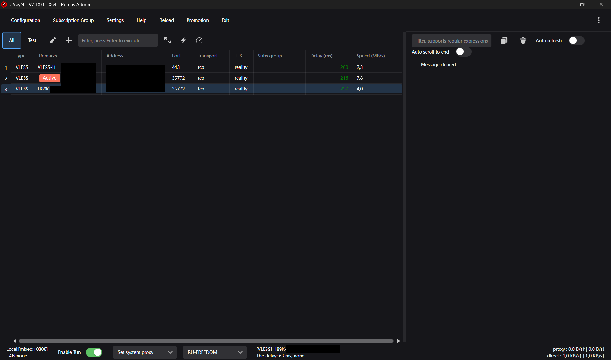

### Описание функций и кнопок
* **Enable Tun** - вертуальный сетевой фильтр для перехвата всего трафика.

* **Core mode** - установка режима работы ядра.

> **Clear System Proxy** - очистить системный прокси, фактически выключение прокси для всей системы. **Set System Proxy** - установить системный прокси, активация ядра и маршрутизации в системе, фактически включение локального прокси. **Do not change system proxy** - не изменять системный прокси, автономный режим проксирования который не устанавливается во всей системе а используется при конкретной настройке приложений на использование прокси, например через указание прокси по localhost:mixed-port - `127.0.0.1:10808` в настройках Windows, этот режим требует более пренудительной настройки и не рекомендован. **PAC Mode** - прокси авто-конфигурация, использование скрипта авто-конфигурации, который управляет маршрутизацией.

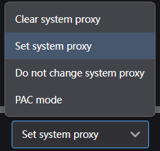

* **Active rule set** - выбор активного правила маршрутизации.

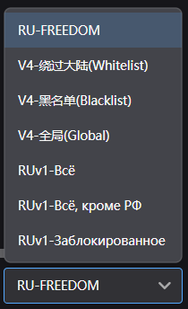

* **Configuration** - добавление сервера, вставка *Share Link* ссылки, сканирование QR-кода из изображения, ручное добавление конфигурации, групповых политик, цепочек прокси, протоколов.

> Используйте *CTRL + V* для вставки **Share Link**. Поддерживаемые протоколы: *VMess, VLESS, Shadowsocks, Trojan, Hysteria2, WireGuard, SOCKS5, HTTP, TUIC, Anytls*.

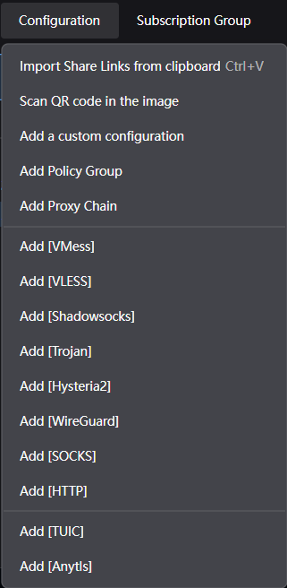

* **Subscription Group** - управление подписками, настройка подписок, обновление всех/текущей подписки с помощью прокси и без.

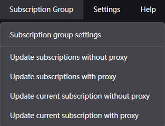

* **Settings** - опции, маршрутизация, днс, конфигурация, горячие клавишы, инструменты, региональные пресеты, архивация и восстановление, локальные файлы.

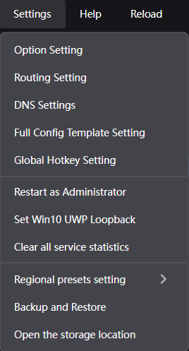

> **Option Setting** основные настройки

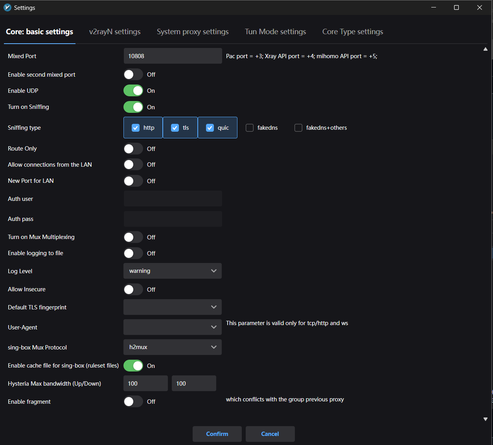
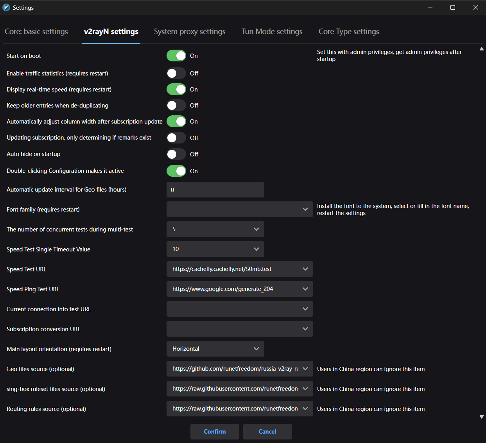
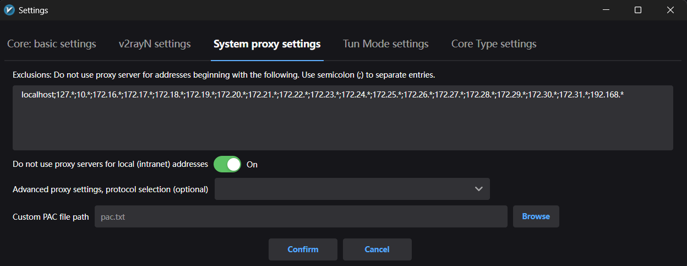
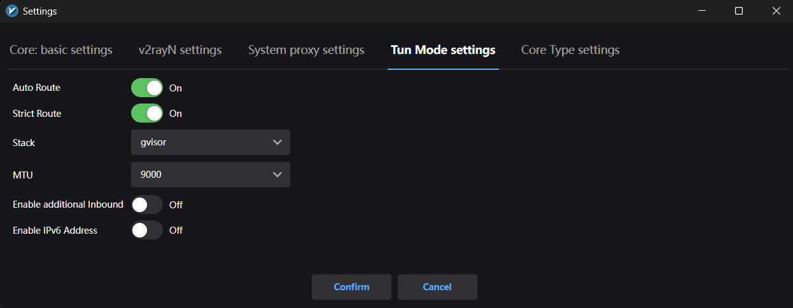
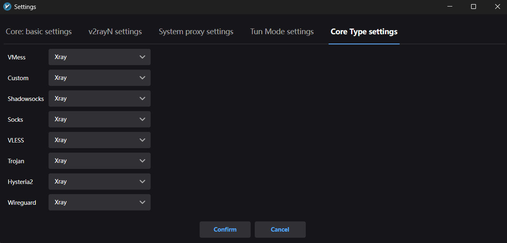

**Core: basic settings**: установка микс-порта, переключение UDP, Sniffing, изменение логирования. **v2rayN settings**: настройки приложения, автозагрузка, отображение скорости передачи, компоновка UI, дабл-клик для активации, источник Geo-файлов. **System proxy settings**: изменение IP для локальных устройств. **Tun Mode settings**. **Core Type settings**.

> **Routing Setting**

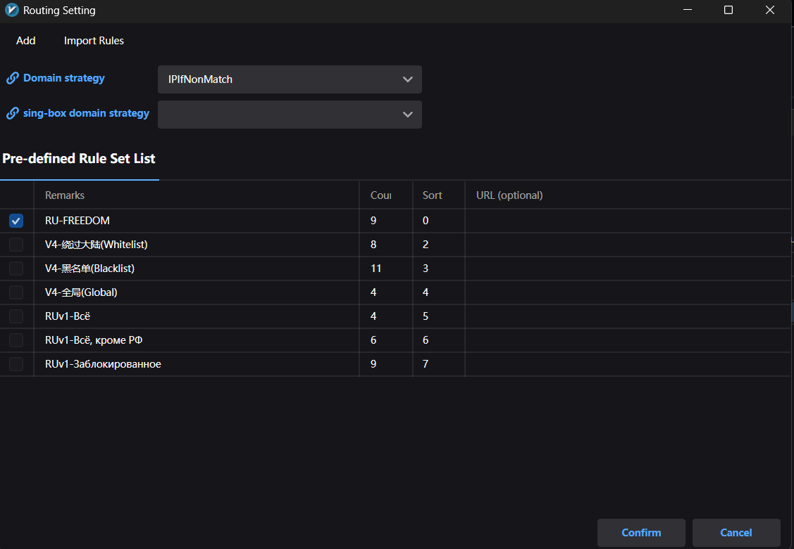

**Domain strategy**: *AsIs* - маршрутизация только по `domain` и `geosite` без DNS, *IPIfNonMatch* - `domain/geosite` маршрутизация с fallback в DNS `ip/geoip`, *IPOnDemand* - `ip/geoip` всегда в DNS.
* **Help** - обновление приложения, ссылки.

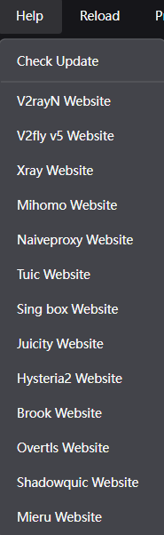

> **V2RayN** - приложение-интерфейс, **Xray** - xray-ядро, **mihomo** - движок необходимый для работы Clash Meta, **sing_box** - движок необходимый для работы Xray/V2Ray, **GeoFiles** - GEO-файлы стран.

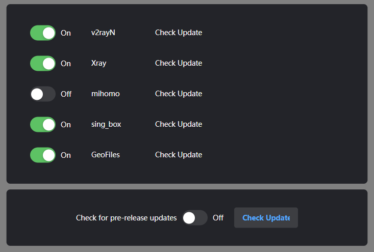

* **Reload** - перезапуск ядра.
* **Promotion** - продвижение рекламы, бесплатные прокси.
* **Exit** - закрыть приложение.
* **⋮** - изменение темы UI, шрифта, языка.
> Поддерживаемые языки: zh-Hans (упрощенный китайский язык) zh-Hant (традиционный китайский язык), en (английский), fa lr (персидский), fr (французкий), ru (русский), hu (венгерский).

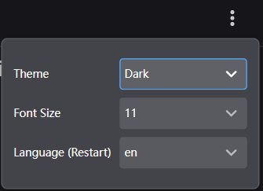

## Первоначальная настройка и запуск
### автозагрузка

> Settings → Option Setting → v2rayN setting → Start on boot (изменяется только при запуске *от администратора*), Geo files source (Подробнее в "Установка собственного ядра [Wiki#支持的核心列表](https://github.com/2dust/v2rayN/wiki/List-of-supported-cores)").

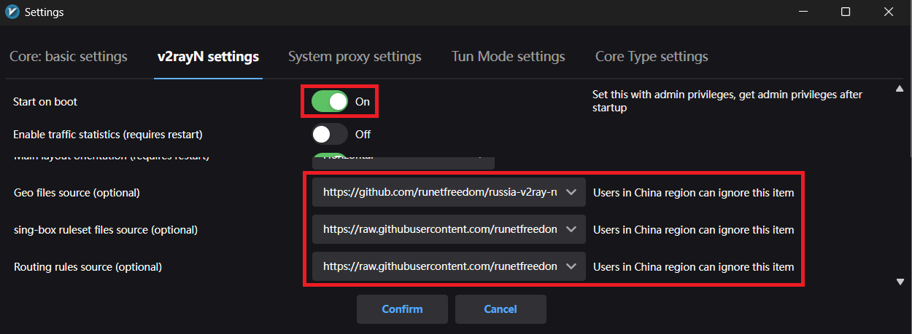

### Выбор региональных пресетов

> Settings → Regional presets setting

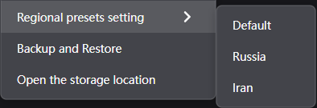

### Настройка маршрутизации

> Settings → Routing Settings → Rule

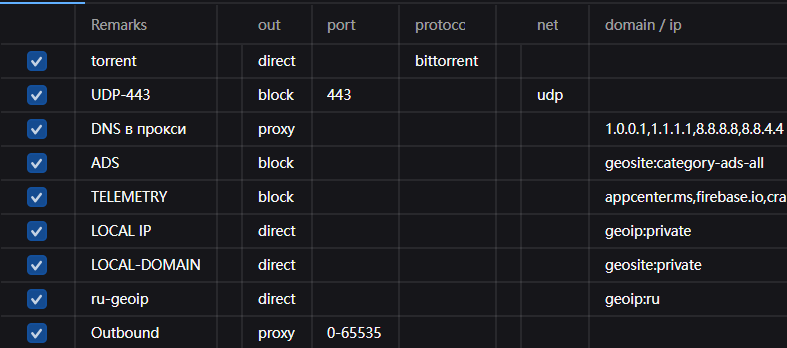

### Выбор активного правила

> Active rule set

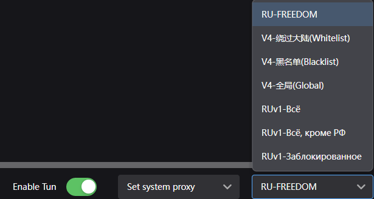

### Включение

> Tun и system proxy

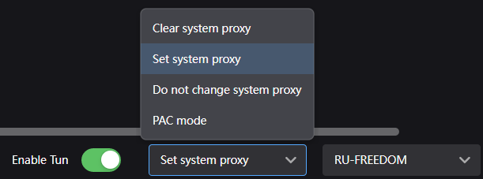

# V2RayNG (Android)
## Отличия системных версий
### Snapdragon, MediaTek, Exynos
* `v2rayNG_arm64-v8a.apk` 64-битные ARM
* `v2rayNG_armeabi-v7a.apk` 32-битные ARM
### Universal
* `v2rayNG_universal.apk` все архитектуры в одном APK
### Emulator, Tablet, Atom
* `v2rayNG_x86.apk` 32-битные Intel/AMD
* `v2rayNG_x86_64.apk` 64-битные Intel/AMD
## Установка приложения
V2RayNG - прокси-клиент для Android https://github.com/2dust/v2rayNG/releases/latest

> Рекомендую скачивать объект: `v2rayNG_arm64-v8a.apk`.